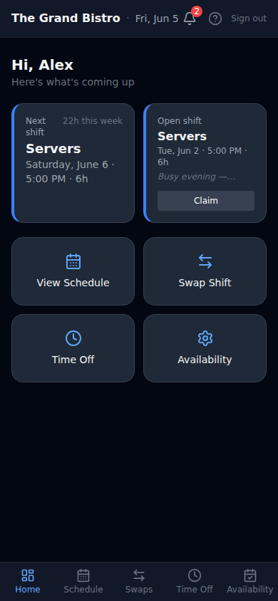
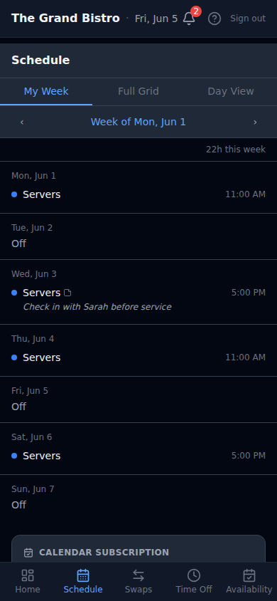
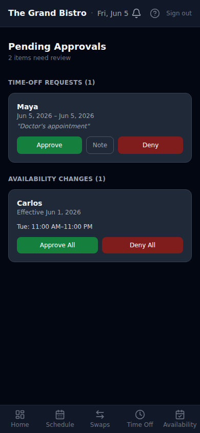
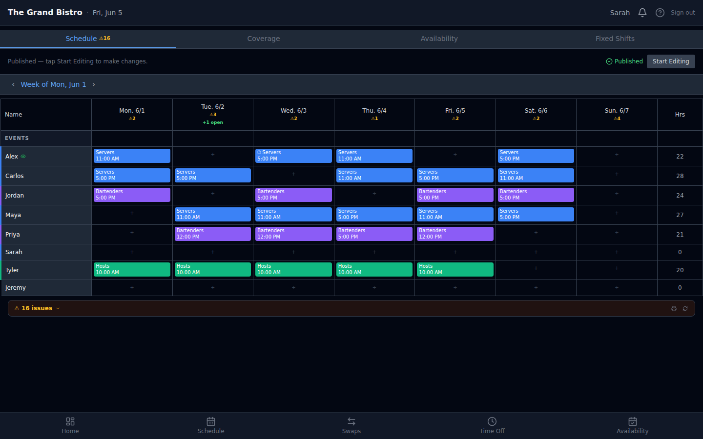
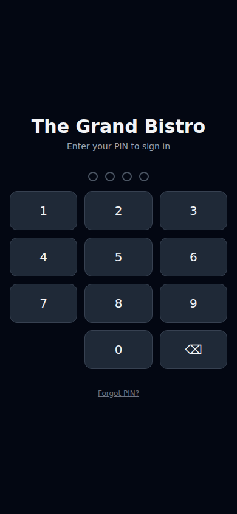
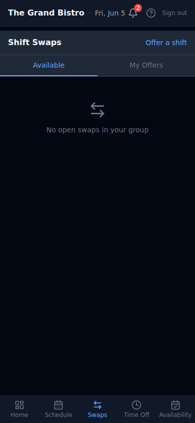
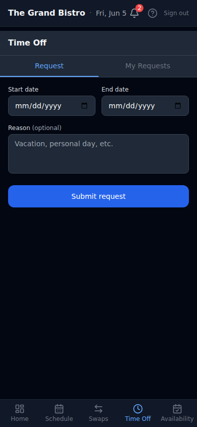
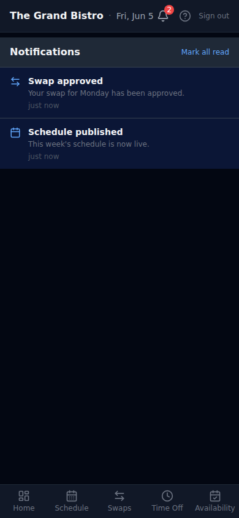

# Shiftable

**Self-hosted restaurant scheduling for teams of 1–60 staff.**

Shiftable is a mobile-first progressive web app that handles shift scheduling, staff availability, shift swaps, time-off requests, and push notifications — all running on a single server you control. No subscription. No third-party access to your staff data.

<p align="center">
  
  &nbsp;&nbsp;&nbsp;
  
  &nbsp;&nbsp;&nbsp;
  
</p>

---

## What it does

- **Auto-scheduler** — generates a draft schedule from your groups, shift templates, coverage rules, and staff availability. One click to fill the week, then edit what the algorithm missed.
- **Shift swaps** — staff offer and claim swaps. Safe swaps (same group, available, under hour limit) are approved automatically. Edge cases go to the manager queue.
- **Time-off requests** — full request and approval flow with manager notes and push notifications.
- **Availability management** — staff submit weekly availability patterns with an effective date. The scheduler respects them automatically.
- **Push notifications** — real-time alerts for schedule changes, swap resolutions, and approvals. Works on iOS and Android.
- **Broadcast messaging** — send announcements to all staff or a specific group.
- **Three roles** — staff, manager, and admin. Managers build schedules and handle approvals. Admins manage settings, users, and backups.
- **PWA install** — installs to the home screen like a native app. No app store required.

---

## Schedule builder

<p align="center">
  
</p>

The schedule builder shows the full week grid with all staff, hours per person, and coverage warnings. Generate a draft, adjust manually, publish — staff get notified immediately.

---

## Full week grid

<p align="center">
  
</p>

The full week view is available to all staff. Group-coloured shift pills, horizontal scroll on mobile, sticky name column.

---

## Staff experience

<p align="center">
  
  &nbsp;&nbsp;&nbsp;
  
  &nbsp;&nbsp;&nbsp;
  
  &nbsp;&nbsp;&nbsp;
  
</p>

Staff log in with a PIN — no passwords, no usernames, no app to download. The claim flow sends a link that sets their PIN and installs the PWA in one step.

---

## One-command install

Shiftable runs on a standard Ubuntu server. The installer handles Node.js, nginx, SSL (via Certbot or DuckDNS), systemd, and database setup — all interactively.

```bash
sudo bash -c "$(curl -fsSL https://raw.githubusercontent.com/Mousebeast/Shiftable/master/install/install.sh)"
```

The installer asks a few questions and then handles everything. Three connectivity options:

| Setup | How |
|---|---|
| You have a domain | Installer configures nginx + Certbot automatically |
| No domain, static IP | Installer sets up a free [DuckDNS](https://www.duckdns.org) address + SSL |
| Local network only | HTTP mode — full app, no push notifications |

Multiple installs on one server are supported — each gets its own directory, port, service, and subdomain.

---

## Requirements

- Ubuntu 22.04+ (or Debian 12+)
- 1 GB RAM (2 GB recommended)
- 10 GB disk space
- Root / sudo access

Node.js, nginx, and all other dependencies are installed automatically.

---

## Updates

When an update is available, the admin panel shows a badge with the exact command to run:

```bash
sudo bash /opt/shiftable-<slug>/update.sh
```

The update script backs up your database, pulls the latest code, rebuilds, runs migrations, and restarts the service.

---

## Documentation

Full documentation is in the [Wiki](https://github.com/Mousebeast/Shiftable/wiki):

- [Quickstart](https://github.com/Mousebeast/Shiftable/wiki/Quickstart) — first 10 minutes after install
- [Installation Guide](https://github.com/Mousebeast/Shiftable/wiki/Installation-Guide) — full walkthrough of all three install paths
- [Configuration Reference](https://github.com/Mousebeast/Shiftable/wiki/Configuration-Reference) — all settings and environment variables
- [Staff Guide](https://github.com/Mousebeast/Shiftable/wiki/Staff-Guide) — for your team
- [Manager Guide](https://github.com/Mousebeast/Shiftable/wiki/Manager-Guide) — scheduling, approvals, groups
- [Admin Guide](https://github.com/Mousebeast/Shiftable/wiki/Admin-Guide) — settings, backups, user management
- [Updating Shiftable](https://github.com/Mousebeast/Shiftable/wiki/Updating-Shiftable) — how updates work
- [Troubleshooting](https://github.com/Mousebeast/Shiftable/wiki/Troubleshooting) — common issues and fixes

---

## Tech stack

| Layer | Technology |
|---|---|
| Backend | Node.js 20 + Express |
| Database | SQLite (better-sqlite3) |
| Frontend | React 18 + Vite + shadcn/ui |
| Styling | Tailwind CSS |
| Push | Web Push (VAPID, self-hosted) |
| Email | Nodemailer (SMTP configurable) |
| Auth | JWT in httpOnly cookies, PIN login |
| Proxy | nginx |
| Process | systemd |

Single process, single file database, single server. Designed to stay simple.
